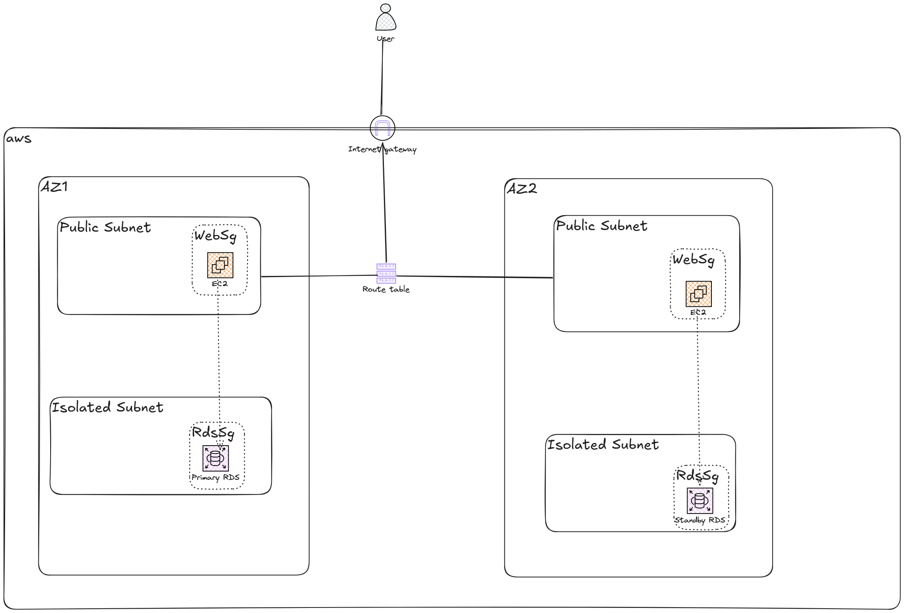

# TechHealth Inc. - Patient Portal Infrastructure Migration to AWS CDK

TechHealth Inc.'s patient portal was originally built manually through the AWS Console five years ago - undocumented, hard to reproduce, and hard to audit. This project migrates that infrastructure to **AWS CDK (TypeScript)**, replacing manual console configuration with version-controlled, repeatable Infrastructure as Code.

Full write-up (architecture rationale, cost breakdown, security design, lessons learned): see `TechHealth-Migration-Documentation.docx` in this repo, or the [Medium post](#).

## Architecture



- **VPC** across 2 Availability Zones, each with one public subnet and one private *isolated* subnet (no NAT Gateway - the database tier never needs outbound internet access)
- **EC2** (t3.micro) in the public subnets, running the patient portal web app
- **RDS MySQL** (db.t3.micro, Multi-AZ) in the private isolated subnets
- **Security Groups**: the database tier only accepts traffic from the web tier's security group — never from an IP range or the VPC CIDR
- **IAM + SSM Session Manager** for administrative access to EC2 - no open SSH port, no key pairs to manage
- **Secrets Manager** for the database credentials — never hardcoded

## Project structure

```
techhealth-migration-cdk/
├── bin/
│   └── techhealth-cdk.ts        # App entry point — instantiates all 4 stacks
├── lib/
│   ├── techhealth-migration-cdk-stack.ts   # VPC / networking
│   ├── sg-stack.ts                          # Security groups
│   ├── ec2-stack.ts                         # EC2 + IAM role
│   └── rds-stack.ts                         # RDS MySQL (Multi-AZ)
├── cdk.json
├── package.json
└── tsconfig.json
```

## Prerequisites

- Node.js and npm
- AWS CLI, configured (`aws configure`)
- AWS CDK: `npm install -g aws-cdk`
- [Session Manager plugin](https://docs.aws.amazon.com/systems-manager/latest/userguide/session-manager-working-with-install-plugin.html) (for connecting to EC2 after deployment)

## Setup

```bash
npm install
npx cdk bootstrap   # once per AWS account/region
npx cdk synth        # sanity-check before deploying
npx cdk deploy --all
```

CDK will prompt to approve IAM and security-group changes before deploying, since these are security-sensitive.

## Connecting to EC2

No SSH, no key pair — this project uses SSM Session Manager:

```bash
aws ssm start-session --target <instance-id>
```

(Instance ID is in the CloudFormation outputs after deploy, or the EC2 console.)

## Testing EC2 → RDS connectivity

```bash
sudo dnf install mariadb105 -y
aws secretsmanager get-secret-value --secret-id <secret-arn> --query SecretString --output text
mysql -h <rds-endpoint> -u admin -p
```

A successful connection confirms EC2-to-RDS connectivity. Attempting the same connection from outside the VPC should fail — confirming network isolation.

## Tearing down

```bash
npx cdk destroy --all
```

Verify in the AWS Console that all resources (VPC, EC2, RDS, security groups, IAM role) are fully removed.

## Design notes

- **t3.micro instead of t2.micro** — chosen for regional instance-type availability (deployment region: Canada)
- **SSM instead of SSH** — stronger security posture (no open inbound port, IAM-governed, every session logged) at the cost of requiring the Session Manager plugin locally
- **RDS Multi-AZ instead of two independent RDS instances** — same cost as running two separate instances, but with real synchronized failover instead of two disconnected databases
- **No NAT Gateway** — the isolated private subnet has no internet route at all, which is both cheaper and more secure than a NAT-egress subnet the database doesn't need
